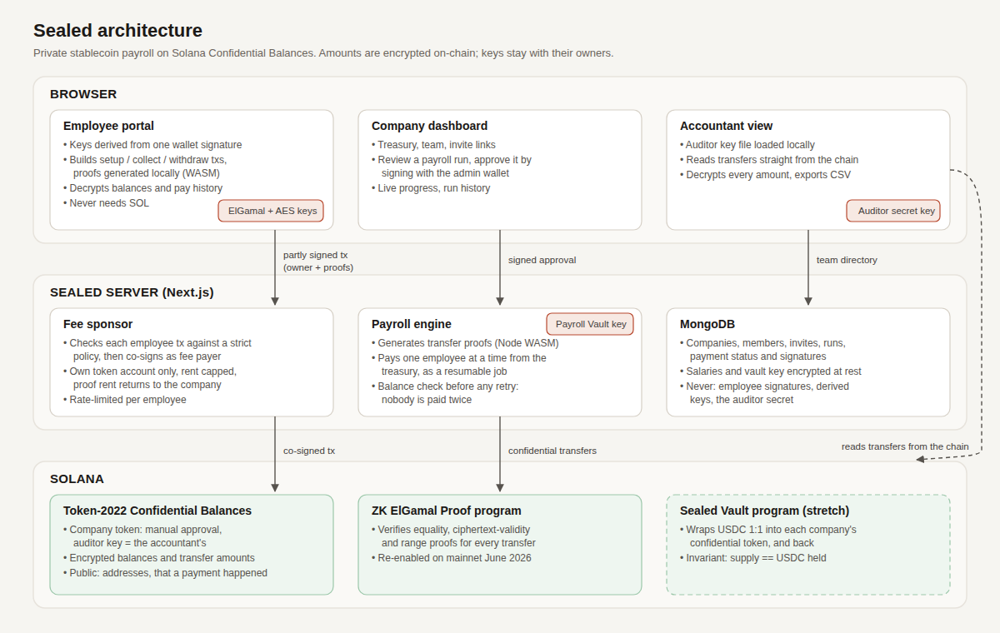

# Sealed

**Private stablecoin payroll on Solana.** Companies pay their teams on-chain, and only the employer,
the employee and the company's accountant can see how much anyone earns.

Built on Solana's native **Confidential Balances** (Token-2022), which were re-enabled on mainnet in
June 2026: amounts and balances are encrypted on-chain, and every payment is still verified by the
network with zero-knowledge proofs.

| Who | What they can see |
|---|---|
| Company admin | What it pays each person, and the treasury balance |
| Employee | Their own payments and balance, decrypted in their browser with keys from their own wallet |
| Accountant | Every payment amount, with a view-only auditor key |
| Everyone else | That a payment happened between two addresses, and when. **Not the amount.** |

Sealed hides amounts and balances, not identities: wallet addresses stay public, and so do amounts
moved into or out of confidential balances (funding the treasury, withdrawing).

> **Status:** test networks only (devnet or a local mainnet fork). The core flow, the company
> dashboard, the employee portal and the accountant view all work end to end on a Surfpool mainnet
> fork. The devnet run is pending an outage of the public devnet RPC.

## How it works



- **Keys come from the wallet.** Each person's encryption keys are derived from one wallet signature
  over a constant message (`deriveConfidentialKeys`, the same derivation as the `spl-token` CLI), so
  there is nothing extra to store, and the keys never leave the browser.
- **The company pays every fee.** Employee transactions (setting up the private account, collecting
  pay, withdrawing) are built and proven in the employee's browser, then co-signed by the company
  as fee payer. Before co-signing, the server checks each transaction against a strict policy
  ([`packages/core/src/sponsor.ts`](packages/core/src/sponsor.ts)), so the company's SOL can only pay for the
  employee's own account. Employees never need SOL.
- **Payroll runs are resumable jobs.** The admin reviews a run and approves it with a wallet
  signature. The server then generates the transfer proofs and pays one employee at a time
  (each proof depends on the treasury balance before it). Before retrying an interrupted payment,
  it checks the treasury balance, so nobody is paid twice.
- **Compliance is built in.** Each company token carries the accountant's auditor key, so every
  transfer also encrypts its amount for the accountant. The auditor key is generated in the admin's
  browser and saved as a file; the server never has it.
- **Each company has its own token,** with manual approval, so only its team can hold it. The
  **Sealed Vault** program ([`programs/sealed-vault`](programs/sealed-vault)) backs it 1:1 with USDC:
  `wrap` takes USDC in and mints company tokens, and `unwrap` burns them and pays USDC out. Only
  the vault can mint, and every instruction checks on-chain that supply equals the USDC held. The
  web app still funds treasuries with a test token; the vault flow is tested end to end in
  `packages/core`.

## Repo layout

| Path | What it is |
|---|---|
| [`packages/core`](packages/core) | All the Confidential Balances logic: keys, account setup, deposit, pay, collect, withdraw, balance and history decryption, auditor decryption, the sponsor policy. Unit and integration tests. |
| [`apps/web`](apps/web) | Next.js app: company dashboard, employee portal, accountant view, API, payroll engine, fee sponsor. |
| [`programs/sealed-vault`](programs/sealed-vault) | Anchor program that backs each company token 1:1 with USDC (`init_company`, `wrap`, `unwrap`). |
| [`scripts/day1-confidential-transfer.sh`](scripts/day1-confidential-transfer.sh) | The day-1 go/no-go test with the `spl-token` CLI. |
| [`docs`](docs) | Architecture, pitch, demo script, traction kit, submission notes. |
| [`CLAUDE.md`](CLAUDE.md) | The full project plan and its milestones. |

## Run it locally

Requirements: Node 24+, pnpm (`corepack enable pnpm`), Docker, and a cluster with the ZK ElGamal
proof program: [Surfpool](https://surfpool.run) (a local mainnet fork) or devnet. A stock
`solana-test-validator` does not enable the proof program.

```bash
pnpm install
docker compose up -d                                    # MongoDB
surfpool start --network mainnet --no-tui               # in another terminal
cp apps/web/.env.example apps/web/.env.local            # then fill in DATA_ENCRYPTION_KEY
pnpm dev                                                # http://localhost:3000
```

In `apps/web/.env.local`, set `NEXT_PUBLIC_SOLANA_CLUSTER=localnet` for Surfpool, or `devnet` for devnet.
Generate `DATA_ENCRYPTION_KEY` with:

```bash
node -e "console.log(require('crypto').randomBytes(32).toString('base64'))"
```

### On devnet

Set `NEXT_PUBLIC_SOLANA_CLUSTER=devnet`. A private devnet RPC (Helius, Triton, QuickNode) is the
most reliable choice. With the public one: on Sep 27, 2026, `api.devnet.solana.com` failed account
reads and deep history queries while everything else worked. For that case there's a local proxy
that routes those calls to a second public RPC and paces requests:

```bash
node scripts/devnet-rpc-proxy.mjs          # http://127.0.0.1:8898
```

Then, in `apps/web/.env.local`:

```
NEXT_PUBLIC_RPC_URL=http://127.0.0.1:8898
NEXT_PUBLIC_RPC_SUBSCRIPTIONS_URL=wss://api.devnet.solana.com
```

Devnet airdrops are often rate-limited. To seed the demo company, fund its vault from a local wallet
that holds devnet SOL (about 0.3 SOL is enough):

```bash
pnpm seed --fund-from ../../.keys/employer.json
```

### Wallets

Sealed works with Wallet Standard wallets that support devnet (Phantom, Solflare, Backpack). For
demos and testing there's also a built-in **test wallet** that lives in the browser: it can hold
several identities, so one browser can act as the admin, an employee and the accountant. Its keys
sit in `localStorage`, so never use it for anything of value.

### The demo company

```bash
pnpm seed
```

This creates **Acme DAO** with a 10-person team: nine people fully onboarded and paid last month, and
Priya invited but not onboarded, so her onboarding can be shown live. It prints the dashboard link and
Priya's invite link. It also writes these files to `.keys/demo/`, or `.keys/demo-devnet/` on devnet
(both gitignored):
- the auditor key file for the accountant view;
- `test-wallet-identities.json` with the admin and the accountant. Import it from the wallet menu
  (**Import identities from a file**).

To use your own wallets instead: `pnpm seed --admin <ADDRESS> --accountant <ADDRESS>`. This
skips last month's run, because it needs the admin's signature.

## Tests

```bash
pnpm test                 # unit tests: amounts, auditor decryption, the sponsor policy
pnpm test:integration     # the whole payroll flow on Surfpool (or RPC_URL=devnet)
```

The integration test runs the full flow against a live cluster. A fresh 0-SOL employee is
onboarded, the company funds its treasury and pays them, the employee decrypts their pay and history,
and the accountant decrypts the payment. The employee then collects and withdraws. Every employee
transaction goes through the sponsor policy.

`pnpm test:integration` also runs the Sealed Vault flow when the program is deployed to the cluster.
The flow is USDC in, then wrap, then confidential payroll, then withdraw, then unwrap to USDC. It
also checks that nobody can mint around the vault or redeem against another company's vault.

```bash
pnpm vault:build                      # needs Anchor 1.1 and the Solana CLI
pnpm vault:deploy -u localhost        # or -u devnet
```

The day-1 CLI check is still there too: `bash scripts/day1-confidential-transfer.sh` (devnet by
default, or `RPC_URL=http://127.0.0.1:8899` for Surfpool).

## Security model and known limitations

- **Test networks only.** Nothing here has been audited.
- **The Payroll Vault key lives on the server** (encrypted at rest). That's fine for a test-network
  MVP. For production, proofs would run in the admin's browser, or the key would sit in an HSM/MPC
  service behind multisig approval.
- **Salaries in the database are encrypted** with a key from the environment. Anyone who has both
  the database and that key can read them.
- **Sponsored proof accounts:** the withdraw proof is too large to create and verify in one
  legacy/v0 transaction. In between, someone could take over a company-funded proof account and
  reclaim about 0.002 SOL of rent. Per-employee rate limits bound this, and single-transaction
  proofs with the v1 transaction format close it.
- **Withdrawals are public.** Withdrawing exactly your salary reveals it. The app says so.
- **Kill switch.** The ZK proof program can be disabled network-wide, as happened in 2025. While
  it's off, confidential balances can't move (last time the ciphertexts survived). Sealed keeps only
  the payroll float confidential and encourages employees to withdraw after payday.

## Hackathon

Built for the [Colosseum Crypto World's Fair](https://colosseum.com/worldsfair) and the
[Superteam India track](https://superteam.fun/earn/listing/colosseum-crypto-worlds-fair-hackathon-superteam-india-track).
See [`docs/pitch.md`](docs/pitch.md) and [`docs/demo-script.md`](docs/demo-script.md).
